# MaaS Entity Architecture Proposal
## RFC-001: Unified Model-as-a-Service Entity Framework

**Author:** Noy Itzikowitz - with some help from Claude Code :)  
**Status:** Draft  
**Created:** 2024-10-27  
**Updated:** 2024-10-27  

---

## 1. Executive Summary

This proposal establishes a comprehensive entity framework for the Model-as-a-Service (MaaS) platform that unifies policy enforcement, billing attribution, and observability across all system components. The current implementation lacks proper correlation between users, groups, policies, and subscriptions, resulting in disconnected access control, usage tracking, and cost attribution.

Our proposed model-driven architecture introduces seven core entities with clearly defined relationships that enable:
- **Unified Policy Control**: Hierarchical policies that apply consistently across users, groups, and models
- **Transparent Cost Attribution**: Direct correlation between usage events and billing through subscriptions
- **Comprehensive Observability**: Integrated metrics collection tied to policy enforcement and billing events

This framework aligns with industry standards including OPA/Cedar for policy management, SCIM 2.0 for identity schemas, FinOps principles for cost attribution, and OpenTelemetry for observability.

**Business Impact:**
- Enables scalable multi-tenant AI platform operations
- Provides transparent cost controls and predictable billing
- Supports enterprise-grade compliance and governance requirements
- Facilitates AI model marketplace scenarios with pay-per-use models

---

## 2. Problem Statement

### Current System Gaps

**Entity Relationship Deficiencies:**
- Users and groups lack proper hierarchical structure and membership management
- No clear correlation between user identity, access policies, and billing entitlements
- Policies are applied inconsistently without proper inheritance or override mechanisms
- Subscription management is disconnected from actual usage and policy enforcement

**Orchestration Gaps:**
- Access control decisions are isolated from billing and observability systems
- Usage tracking occurs independently of policy evaluation, creating data silos
- Cost attribution cannot be traced back to specific users, groups, or policy decisions
- No unified event model for correlating policy enforcement with billing and metrics

**Operational Challenges:**
- Inability to provide transparent cost breakdowns by user, group, or model
- Difficulty implementing enterprise governance and compliance requirements
- Limited scalability for multi-tenant scenarios with complex hierarchies
- Lack of standardized interfaces for policy management and billing integration

---

## 3. Goals and Non-Goals

### Goals

**Primary Objectives:**
1. **Unified Entity Model**: Establish consistent relationships between all core MaaS entities
2. **Policy-Driven Architecture**: Implement hierarchical policy inheritance with clear override rules
3. **Transparent Billing**: Enable direct correlation between usage events and cost attribution
4. **Integrated Observability**: Correlate metrics with policy decisions and billing events
5. **Standards Compliance**: Align with industry standards for identity, policy, and observability
6. **Scalable Multi-Tenancy**: Support enterprise hierarchies and marketplace scenarios

**Secondary Objectives:**
- Enable self-service subscription management
- Provide audit trails for compliance requirements
- Support dynamic quota and rate limiting based on subscriptions
- Facilitate cost optimization through usage analytics

### Non-Goals

**Explicitly Out of Scope:**
- UI/UX design for management interfaces
- Third-party billing system integrations (Stripe, AWS Billing, etc.)
- Model hosting infrastructure or serving optimization
- Authentication provider implementations (OAuth, SAML, etc.)
- Data persistence layer implementation details
- Performance optimization strategies
- Migration tooling from current implementation

---

## 4. Entities Overview

### Core Entity Relationships

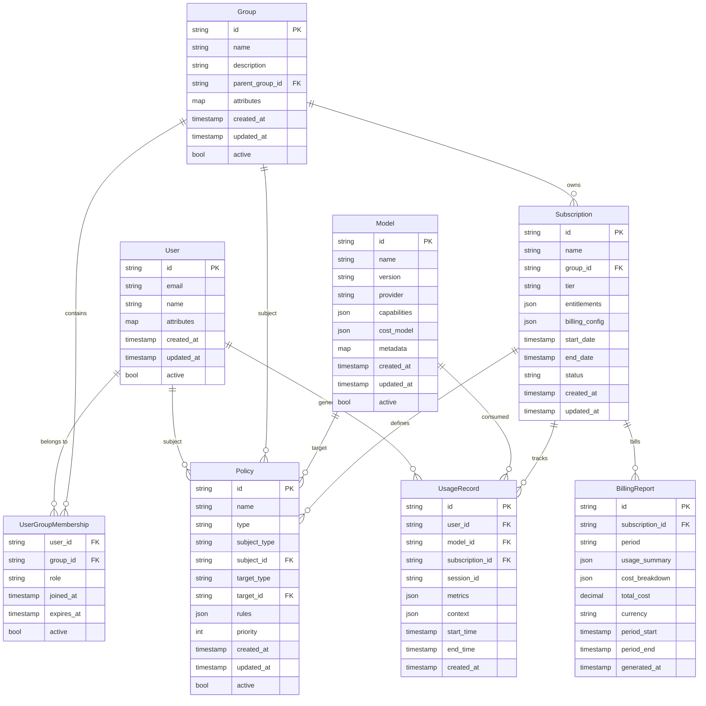

### Entity Definitions

#### User Entity

**Purpose**: Represents individual users with identity and attribute information compliant with SCIM 2.0 standards.

**Attributes:**
| Field | Type | Description | Required |
|-------|------|-------------|----------|
| `id` | string | Unique user identifier (UUID) | Yes |
| `email` | string | Primary email address | Yes |
| `name` | string | Display name | Yes |
| `attributes` | map | Extensible user attributes (SCIM compliant) | No |
| `created_at` | timestamp | User creation time | Yes |
| `updated_at` | timestamp | Last modification time | Yes |
| `active` | boolean | User account status | Yes |

**Responsibilities:**
- Identity representation for policy evaluation
- Usage tracking and billing attribution
- Group membership management

**Relationships:**
- Many-to-many with Groups through UserGroupMembership
- One-to-many with UsageRecords
- One-to-many with Policies (as subject)

#### Group Entity

**Purpose**: Hierarchical organizational units that enable policy inheritance and subscription management.

**Attributes:**
| Field | Type | Description | Required |
|-------|------|-------------|----------|
| `id` | string | Unique group identifier (UUID) | Yes |
| `name` | string | Group display name | Yes |
| `description` | string | Group purpose description | No |
| `parent_group_id` | string | Parent group for hierarchy | No |
| `attributes` | map | Extensible group metadata | No |
| `created_at` | timestamp | Group creation time | Yes |
| `updated_at` | timestamp | Last modification time | Yes |
| `active` | boolean | Group status | Yes |

**Responsibilities:**
- Organizational hierarchy for policy inheritance
- Subscription ownership and entitlement management
- User membership and role assignment

**Relationships:**
- Self-referential hierarchy through parent_group_id
- Many-to-many with Users through UserGroupMembership
- One-to-many with Subscriptions
- One-to-many with Policies (as subject)

#### Policy Entity

**Purpose**: Defines access controls, rate limits, and usage policies using OPA/Cedar-compatible rule structures.

**Attributes:**
| Field | Type | Description | Required |
|-------|------|-------------|----------|
| `id` | string | Unique policy identifier (UUID) | Yes |
| `name` | string | Human-readable policy name | Yes |
| `type` | string | Policy type (RBAC, ABAC, Rate, Quota) | Yes |
| `subject_type` | string | Subject entity type (User, Group) | Yes |
| `subject_id` | string | Subject entity identifier | Yes |
| `target_type` | string | Target entity type (Model, Resource) | No |
| `target_id` | string | Target entity identifier | No |
| `rules` | json | Policy rules in OPA/Cedar format | Yes |
| `priority` | integer | Policy evaluation priority (higher wins) | Yes |
| `created_at` | timestamp | Policy creation time | Yes |
| `updated_at` | timestamp | Last modification time | Yes |
| `active` | boolean | Policy status | Yes |

**Responsibilities:**
- Access control enforcement
- Rate limiting and quota management
- Policy inheritance and conflict resolution

**Relationships:**
- Many-to-one with Users (as subject)
- Many-to-one with Groups (as subject)
- Many-to-one with Models (as target)
- Referenced by Subscriptions for entitlement policies

#### Subscription Entity

**Purpose**: Manages entitlements, billing configurations, and usage tracking for groups and their members.

**Attributes:**
| Field | Type | Description | Required |
|-------|------|-------------|----------|
| `id` | string | Unique subscription identifier (UUID) | Yes |
| `name` | string | Subscription display name | Yes |
| `group_id` | string | Owning group identifier | Yes |
| `tier` | string | Service tier (Free, Pro, Enterprise) | Yes |
| `entitlements` | json | Usage limits and access controls | Yes |
| `billing_config` | json | Billing rates and payment settings | Yes |
| `start_date` | timestamp | Subscription start time | Yes |
| `end_date` | timestamp | Subscription end time | No |
| `status` | string | Active, Suspended, Expired | Yes |
| `created_at` | timestamp | Subscription creation time | Yes |
| `updated_at` | timestamp | Last modification time | Yes |

**Entitlements Structure:**
```json
{
  "rate_limits": {
    "requests_per_minute": 100,
    "tokens_per_hour": 10000
  },
  "quotas": {
    "monthly_requests": 50000,
    "monthly_tokens": 1000000
  },
  "model_access": ["gpt-4", "claude-3"],
  "features": ["priority_support", "advanced_analytics"]
}
```

**Responsibilities:**
- Define usage entitlements and limits
- Track subscription lifecycle and billing periods
- Generate policies for quota and rate limiting

**Relationships:**
- Many-to-one with Groups
- One-to-many with UsageRecords
- One-to-many with BillingReports

#### Model Entity

**Purpose**: Represents AI models with capabilities, cost structures, and access policies.

**Attributes:**
| Field | Type | Description | Required |
|-------|------|-------------|----------|
| `id` | string | Unique model identifier | Yes |
| `name` | string | Model display name | Yes |
| `version` | string | Model version identifier | Yes |
| `provider` | string | Model provider (OpenAI, Anthropic, etc.) | Yes |
| `capabilities` | json | Model capabilities and specifications | Yes |
| `cost_model` | json | Pricing structure and billing rates | Yes |
| `metadata` | map | Additional model information | No |
| `created_at` | timestamp | Model registration time | Yes |
| `updated_at` | timestamp | Last modification time | Yes |
| `active` | boolean | Model availability status | Yes |

**Cost Model Structure:**
```json
{
  "pricing_type": "token_based",
  "input_token_rate": 0.0001,
  "output_token_rate": 0.0002,
  "currency": "USD",
  "minimum_charge": 0.001,
  "billing_unit": "token"
}
```

**Responsibilities:**
- Define model capabilities and constraints
- Provide cost calculation parameters
- Enable model-specific policy targeting

**Relationships:**
- One-to-many with UsageRecords
- One-to-many with Policies (as target)

#### UsageRecord Entity

**Purpose**: Captures detailed usage events for billing, observability, and policy evaluation.

**Attributes:**
| Field | Type | Description | Required |
|-------|------|-------------|----------|
| `id` | string | Unique usage record identifier (UUID) | Yes |
| `user_id` | string | User who generated usage | Yes |
| `model_id` | string | Model that was consumed | Yes |
| `subscription_id` | string | Associated subscription | Yes |
| `session_id` | string | Request session identifier | Yes |
| `metrics` | json | Detailed usage metrics | Yes |
| `context` | json | Request context and metadata | No |
| `start_time` | timestamp | Usage start time | Yes |
| `end_time` | timestamp | Usage completion time | Yes |
| `created_at` | timestamp | Record creation time | Yes |

**Metrics Structure:**
```json
{
  "input_tokens": 150,
  "output_tokens": 300,
  "processing_time_ms": 2500,
  "gpu_time_ms": 1800,
  "cost_usd": 0.045,
  "response_status": "success",
  "policy_decisions": ["rate_limit_ok", "quota_ok", "access_granted"]
}
```

**Responsibilities:**
- Record all usage for billing and analytics
- Correlate usage with policy decisions
- Provide audit trail for compliance

**Relationships:**
- Many-to-one with Users
- Many-to-one with Models
- Many-to-one with Subscriptions

#### BillingReport Entity

**Purpose**: Aggregates usage data into billing periods with cost breakdowns and invoice generation.

**Attributes:**
| Field | Type | Description | Required |
|-------|------|-------------|----------|
| `id` | string | Unique billing report identifier (UUID) | Yes |
| `subscription_id` | string | Associated subscription | Yes |
| `period` | string | Billing period (monthly, quarterly) | Yes |
| `usage_summary` | json | Aggregated usage statistics | Yes |
| `cost_breakdown` | json | Detailed cost analysis | Yes |
| `total_cost` | decimal | Total period cost | Yes |
| `currency` | string | Billing currency (USD, EUR, etc.) | Yes |
| `period_start` | timestamp | Billing period start | Yes |
| `period_end` | timestamp | Billing period end | Yes |
| `generated_at` | timestamp | Report generation time | Yes |

**Responsibilities:**
- Generate periodic billing summaries
- Provide cost transparency and analytics
- Support invoice generation and payment processing

**Relationships:**
- Many-to-one with Subscriptions
- Aggregates data from UsageRecords

---

## 5. Policy Model

### Policy Types and Structure

The MaaS platform implements a hierarchical policy model supporting multiple policy types with inheritance and override capabilities. Policies are expressed in OPA Rego or Cedar policy language for standardized evaluation.

#### Policy Types

**1. Role-Based Access Control (RBAC)**
- Controls model access based on user roles and group memberships
- Supports role inheritance through group hierarchy

**2. Attribute-Based Access Control (ABAC)**  
- Evaluates user attributes, request context, and resource properties
- Enables fine-grained access control based on dynamic conditions

**3. Rate Limiting Policies**
- Enforces requests per minute/hour limits based on subscription tiers
- Supports burst allowances and sliding window calculations

**4. Quota Policies**
- Manages monthly/annual usage limits for tokens, requests, and costs
- Provides soft and hard quota enforcement with grace periods

### Policy Hierarchy and Inheritance

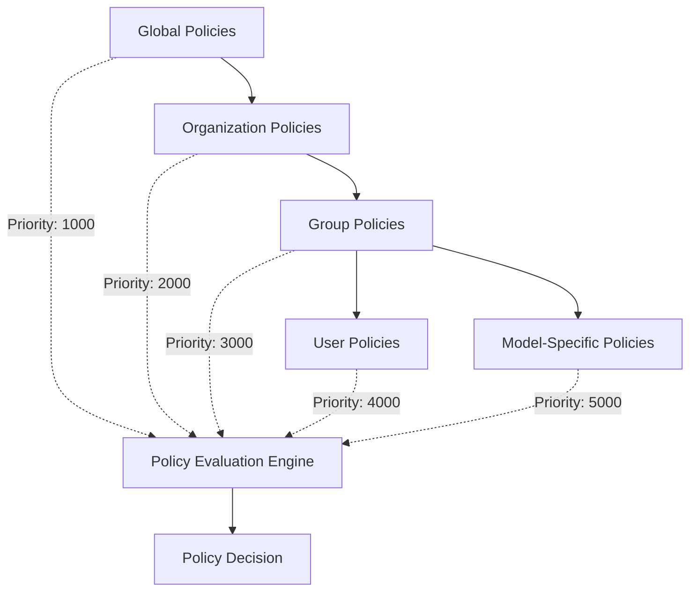

**Inheritance Rules:**
1. **Priority-Based Override**: Higher priority policies override lower priority policies
2. **Additive Permissions**: Access grants are combined across policy levels
3. **Restrictive Limits**: The most restrictive limit applies across all policy levels
4. **Explicit Deny**: Explicit deny rules override all permit rules regardless of priority

### Policy Examples

#### RBAC Policy Example
```yaml
apiVersion: policy.maas.io/v1
kind: Policy
metadata:
  name: "ml-engineer-model-access"
  type: "rbac"
spec:
  subject:
    type: "group"
    id: "ml-engineers"
  target:
    type: "model"
    pattern: "*"
  rules:
    allow:
      - action: "invoke"
        conditions:
          - user.groups contains "ml-engineers"
          - model.tier in ["basic", "standard"]
      - action: "monitor"
        conditions:
          - user.groups contains "ml-engineers"
  priority: 3000
```

#### ABAC Policy Example  
```yaml
apiVersion: policy.maas.io/v1
kind: Policy
metadata:
  name: "context-aware-access"
  type: "abac"
spec:
  subject:
    type: "user"
    pattern: "*"
  target:
    type: "model"
    id: "gpt-4"
  rules:
    allow:
      - action: "invoke"
        conditions:
          - request.source_ip in subscription.allowed_ips
          - time.hour >= 9 && time.hour <= 17
          - user.attributes.security_clearance >= model.security_level
  priority: 4000
```

#### Rate Limiting Policy Example
```yaml
apiVersion: policy.maas.io/v1
kind: Policy
metadata:
  name: "pro-tier-rate-limits"
  type: "rate_limit"
spec:
  subject:
    type: "subscription"
    tier: "pro"
  rules:
    limits:
      - window: "1m"
        max_requests: 100
        burst_allowance: 20
      - window: "1h" 
        max_tokens: 50000
        burst_allowance: 10000
    enforcement: "hard"
    grace_period: "30s"
  priority: 2000
```

#### Quota Policy Example
```yaml
apiVersion: policy.maas.io/v1
kind: Policy  
metadata:
  name: "enterprise-monthly-quota"
  type: "quota"
spec:
  subject:
    type: "group"
    id: "enterprise-team-alpha"
  rules:
    quotas:
      - period: "monthly"
        max_requests: 1000000
        max_tokens: 50000000
        max_cost_usd: 5000
    enforcement: "soft"
    warning_thresholds: [0.8, 0.9, 0.95]
    grace_period: "7d"
  priority: 3000
```

### Policy Evaluation Engine

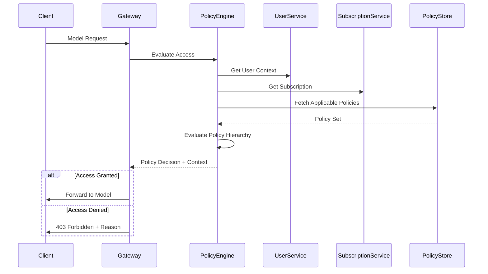

---

## 6. Subscription and Billing Model

### Subscription Tiers and Entitlements

The MaaS platform supports multiple subscription tiers with different entitlements and billing models to accommodate various use cases from individual developers to enterprise customers.

#### Subscription Tiers

| Tier | Target User | Rate Limits | Monthly Quotas | Model Access | Billing Model |
|------|-------------|-------------|----------------|--------------|---------------|
| **Free** | Developers | 10 req/min | 1K requests, 100K tokens | Basic models | Free with limits |
| **Pro** | Teams | 100 req/min | 50K requests, 5M tokens | Standard + GPT-4 | Pay-per-use |
| **Enterprise** | Organizations | 1000 req/min | 1M requests, 100M tokens | All models | Subscription + overages |
| **Marketplace** | Resellers | Custom | Custom per customer | Configurable | Revenue sharing |

### Usage Tracking and Billing Flow

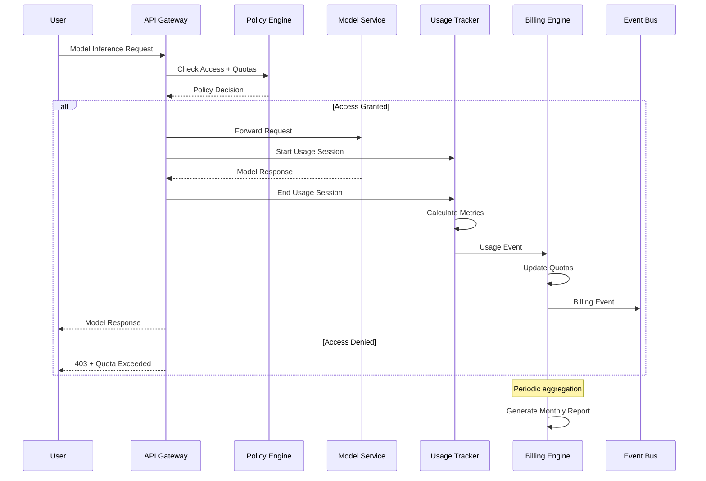

### Usage Event Schema

Usage events follow the CloudEvents specification for standardized event handling and observability integration.

```json
{
  "specversion": "1.0",
  "type": "maas.usage.model.invocation",
  "source": "maas-api-gateway",
  "id": "uuid-here",
  "time": "2024-10-27T10:30:00Z",
  "datacontenttype": "application/json",
  "subject": "user:user-123/model:gpt-4",
  "data": {
    "usage_record_id": "ur-uuid-here",
    "user_id": "user-123",
    "group_id": "group-456", 
    "subscription_id": "sub-789",
    "model_id": "gpt-4",
    "session_id": "session-abc",
    "metrics": {
      "input_tokens": 150,
      "output_tokens": 300,
      "processing_time_ms": 2500,
      "gpu_time_ms": 1800,
      "cost_usd": 0.045
    },
    "context": {
      "request_id": "req-xyz",
      "source_ip": "10.0.1.100",
      "user_agent": "MaaS-SDK/1.0",
      "policy_decisions": [
        "rbac:allow",
        "rate_limit:ok", 
        "quota:ok"
      ]
    },
    "timestamps": {
      "request_start": "2024-10-27T10:30:00.000Z",
      "policy_eval": "2024-10-27T10:30:00.050Z",
      "model_start": "2024-10-27T10:30:00.100Z",
      "model_end": "2024-10-27T10:30:02.600Z",
      "response_sent": "2024-10-27T10:30:02.650Z"
    }
  }
}
```

### Cost Calculation Engine

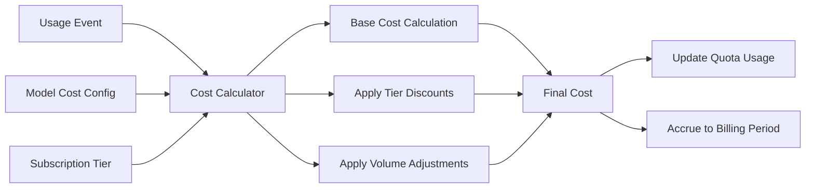

**Cost Calculation Logic:**
1. **Base Cost**: `input_tokens * input_rate + output_tokens * output_rate`
2. **Tier Discounts**: Apply percentage discounts based on subscription tier
3. **Volume Discounts**: Progressive discounts for high-volume usage
4. **Minimum Charges**: Ensure minimum billing thresholds are met
5. **Currency Conversion**: Convert to subscription's billing currency

### Billing Report Generation

Monthly billing reports aggregate usage data and provide detailed cost breakdowns for transparency and cost optimization.

```json
{
  "id": "br-2024-10-enterprise-alpha",
  "subscription_id": "sub-enterprise-alpha",
  "period": "monthly",
  "usage_summary": {
    "total_requests": 450000,
    "total_tokens": 45000000,
    "total_processing_time_ms": 125000000,
    "unique_users": 45,
    "models_used": ["gpt-4", "claude-3", "llama-70b"]
  },
  "cost_breakdown": {
    "base_costs": {
      "gpt-4": 2850.00,
      "claude-3": 1200.00, 
      "llama-70b": 450.00
    },
    "tier_discount": -475.00,
    "volume_discount": -285.00,
    "subtotal": 3740.00,
    "taxes": 374.00
  },
  "total_cost": 4114.00,
  "currency": "USD",
  "period_start": "2024-10-01T00:00:00Z",
  "period_end": "2024-10-31T23:59:59Z",
  "generated_at": "2024-11-01T08:00:00Z"
}
```

---

## 7. Observability Integration

### Metrics Collection Architecture

The MaaS platform implements comprehensive observability using OpenTelemetry standards for metrics, traces, and logs. All observability data is correlated with policy decisions and billing events to provide end-to-end visibility.

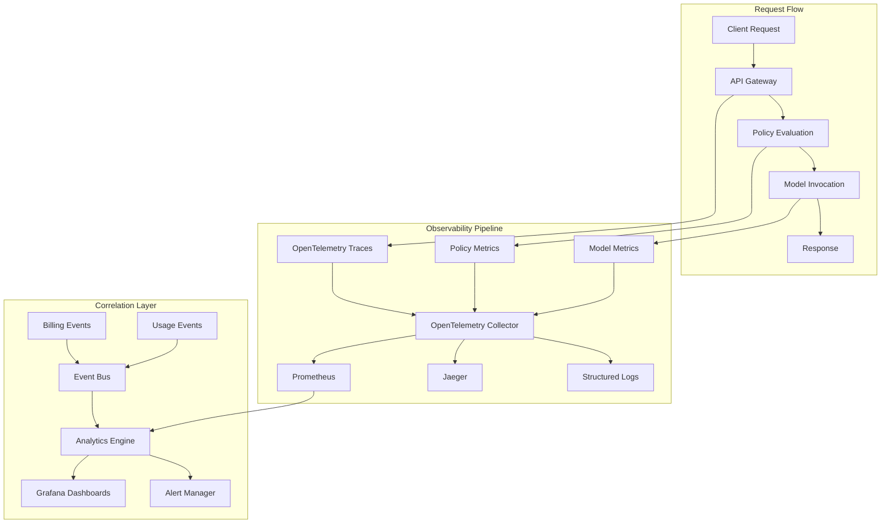

### Key Metrics Categories

#### Request Metrics
- **maas_requests_total**: Total requests by user, group, model, status
- **maas_request_duration_seconds**: Request latency percentiles
- **maas_tokens_processed_total**: Token consumption by model and user
- **maas_cost_accrued_total**: Real-time cost accumulation

#### Policy Metrics  
- **maas_policy_evaluations_total**: Policy evaluation counts by type and result
- **maas_policy_evaluation_duration_seconds**: Policy evaluation latency
- **maas_quota_utilization_ratio**: Quota usage percentage by subscription
- **maas_rate_limit_hits_total**: Rate limit violations by subscription

#### Model Metrics
- **maas_model_availability**: Model uptime and availability
- **maas_model_processing_time_seconds**: Model-specific processing latency
- **maas_model_queue_depth**: Model request queue sizes
- **maas_model_gpu_utilization_ratio**: GPU utilization per model

#### Business Metrics
- **maas_subscription_active_count**: Active subscriptions by tier
- **maas_monthly_recurring_revenue**: Revenue metrics
- **maas_customer_acquisition_cost**: CAC tracking
- **maas_usage_growth_rate**: Usage growth trends

### Trace Correlation

OpenTelemetry traces correlate request flows with policy decisions and billing events:

```yaml
# Example trace span hierarchy
trace_id: "abc123-def456-ghi789"
spans:
  - span_id: "span-001"
    operation_name: "maas.request.handle"
    tags:
      user_id: "user-123"
      subscription_id: "sub-789"
      model_id: "gpt-4"
    
  - span_id: "span-002" 
    parent_span_id: "span-001"
    operation_name: "maas.policy.evaluate"
    tags:
      policy_count: 5
      evaluation_result: "allow"
      quota_remaining: 0.75
      
  - span_id: "span-003"
    parent_span_id: "span-001"
    operation_name: "maas.model.invoke"
    tags:
      input_tokens: 150
      output_tokens: 300
      gpu_time_ms: 1800
      
  - span_id: "span-004"
    parent_span_id: "span-001"
    operation_name: "maas.billing.record"
    tags:
      cost_usd: 0.045
      billing_period: "2024-10"
```

### Event-Driven Observability

CloudEvents integration enables real-time observability with event-driven architectures:

```json
{
  "specversion": "1.0",
  "type": "maas.observability.quota.threshold",
  "source": "maas-billing-engine",
  "id": "threshold-alert-uuid",
  "time": "2024-10-27T15:45:00Z", 
  "subject": "subscription:sub-789/quota:monthly_tokens",
  "data": {
    "subscription_id": "sub-789",
    "quota_type": "monthly_tokens",
    "current_usage": 4500000,
    "quota_limit": 5000000,
    "utilization_percentage": 90.0,
    "threshold_type": "warning",
    "projected_exhaustion": "2024-10-29T12:00:00Z"
  }
}
```

### Compliance and Audit Logging

Structured audit logs capture all system events for compliance and security monitoring:

```json
{
  "timestamp": "2024-10-27T10:30:00Z",
  "level": "INFO",
  "event_type": "policy.access.granted",
  "trace_id": "abc123-def456-ghi789",
  "user_id": "user-123",
  "subscription_id": "sub-789",
  "model_id": "gpt-4",
  "policy_decisions": [
    {
      "policy_id": "pol-rbac-ml-engineers", 
      "policy_type": "rbac",
      "decision": "allow",
      "reason": "user in ml-engineers group"
    },
    {
      "policy_id": "pol-quota-monthly",
      "policy_type": "quota", 
      "decision": "allow",
      "quota_remaining": 0.75
    }
  ],
  "request_context": {
    "source_ip": "10.0.1.100",
    "user_agent": "MaaS-SDK/1.0",
    "api_version": "v1"
  }
}
```

---

## 8. Use Cases (Simple → Complex)

### Use Case 1: Basic Single-User Access

**Scenario**: Individual developer using the Free tier for experimentation

**Entities Involved**:
- User: `dev-alice`
- Group: `individual-users` (default group)
- Subscription: `free-tier-alice` 
- Policy: `free-tier-limits`
- Model: `gpt-3.5-turbo`

**Flow**:
1. Alice registers and is automatically assigned to `individual-users` group
2. System creates `free-tier-alice` subscription with basic entitlements
3. Global `free-tier-limits` policy applies rate and quota limits
4. Alice makes API requests within limits
5. Usage tracked and billed at $0 (free tier)

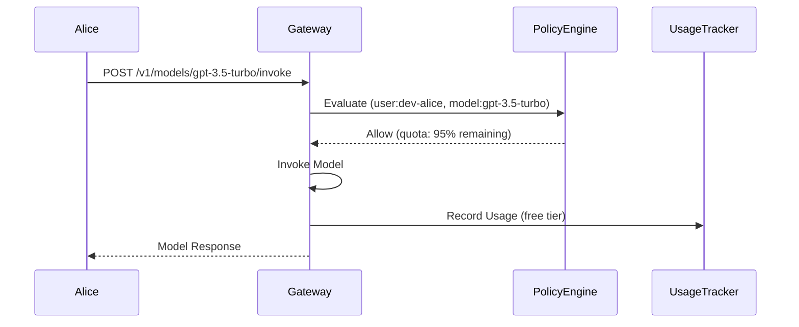

**Policy Example**:
```yaml
name: "free-tier-limits"
type: "quota"
subject:
  type: "subscription"
  tier: "free"
rules:
  quotas:
    - period: "monthly"
      max_requests: 1000
      max_tokens: 100000
  rate_limits:
    - window: "1m"
      max_requests: 10
```

### Use Case 2: Group-Level Subscription with RBAC

**Scenario**: ML engineering team with shared Pro subscription and role-based access

**Entities Involved**:
- Users: `alice`, `bob`, `charlie`
- Group: `ml-team-alpha`
- Subscription: `pro-ml-team-alpha`
- Policies: `ml-engineer-access`, `team-lead-admin`, `pro-tier-limits`
- Models: `gpt-4`, `claude-3`, `llama-70b`

**Group Hierarchy**:
```
ml-team-alpha
├── alice (role: team-lead)
├── bob (role: senior-engineer) 
└── charlie (role: junior-engineer)
```

**Flow**:
1. Team leader Alice creates group and Pro subscription
2. RBAC policies define model access by role:
   - Junior engineers: Basic models only
   - Senior engineers: Standard + GPT-4
   - Team leads: All models + admin access
3. Shared quota pool managed at group level
4. Usage tracked per user but billed to group subscription

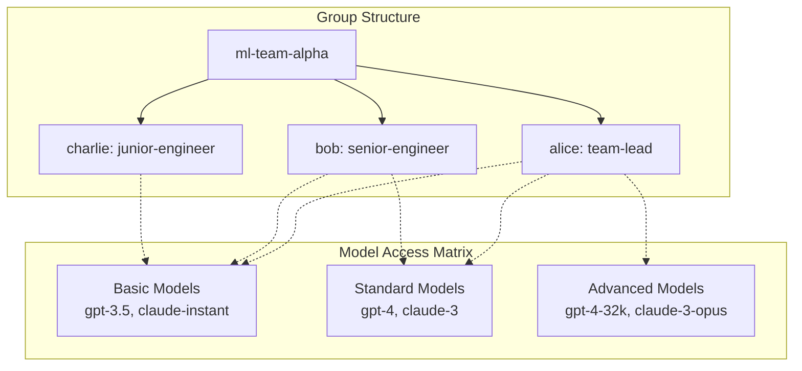

**RBAC Policy Examples**:
```yaml
# Junior engineer policy
name: "junior-ml-engineer-access"
type: "rbac"
subject:
  type: "user"
  attributes:
    role: "junior-engineer"
target:
  type: "model"
  tier: "basic"
rules:
  allow:
    - action: "invoke"
      conditions:
        - user.role == "junior-engineer"
        - model.tier == "basic"
```

### Use Case 3: Enterprise Multi-Group Hierarchy

**Scenario**: Large enterprise with multiple departments, hierarchical policies, and complex billing

**Organization Structure**:
```
acme-corp (root)
├── engineering-dept
│   ├── ml-team-alpha
│   ├── ml-team-beta
│   └── platform-team
├── product-dept
│   ├── product-analytics
│   └── user-research
└── research-dept
    ├── ai-research
    └── data-science
```

**Entities Involved**:
- 50+ users across 8 groups
- 3 enterprise subscriptions (by department)
- Hierarchical policies with inheritance
- 15+ models with varying access levels
- Complex cost allocation and chargeback

**Policy Hierarchy**:
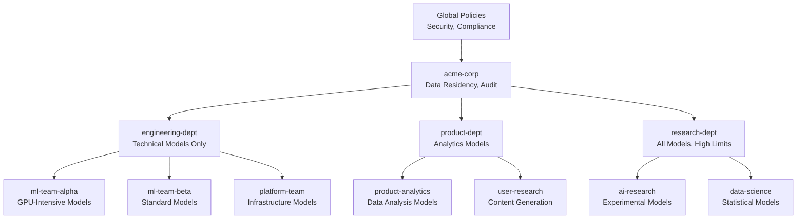

**Cost Allocation Flow**:
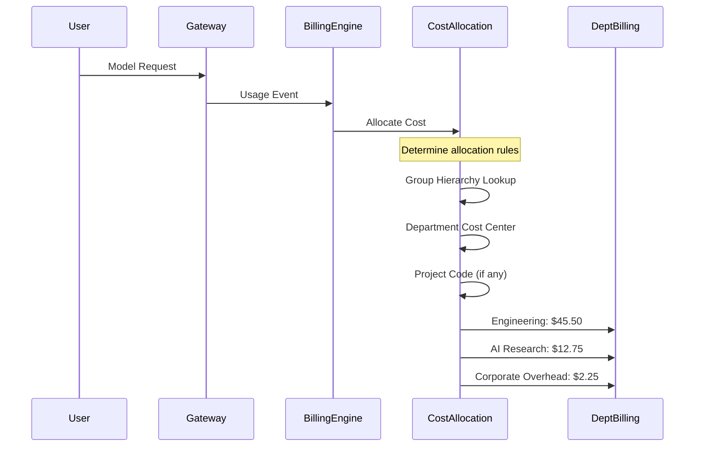

### Use Case 4: AI Model Marketplace

**Scenario**: Multi-tenant marketplace where model providers offer services with dynamic pricing

**Marketplace Structure**:
- **Model Providers**: OpenAI, Anthropic, Meta, Custom Models
- **Customers**: Enterprise clients, ISVs, individual developers  
- **Resellers**: Channel partners with revenue sharing
- **Platform**: MaaS marketplace operator

**Complex Entities**:
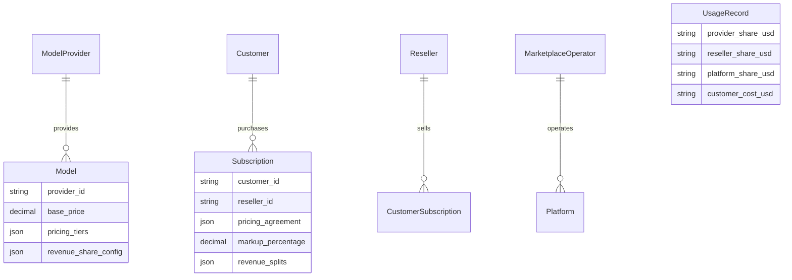

**Dynamic Pricing Flow**:
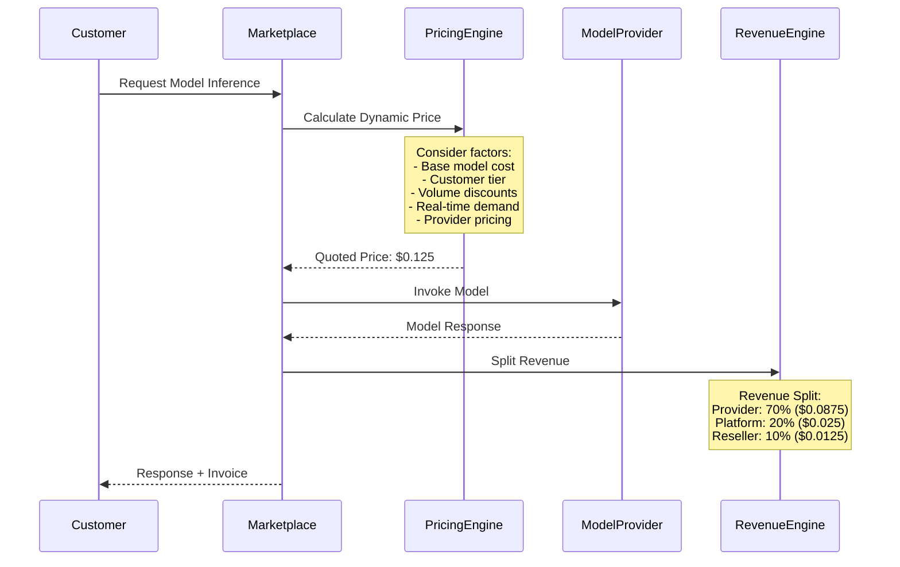

**Marketplace Policies**:
```yaml
# Dynamic pricing policy
name: "marketplace-dynamic-pricing"
type: "pricing"
subject:
  type: "marketplace_customer"
rules:
  base_pricing: "provider_config"
  modifiers:
    - type: "volume_discount"
      tiers:
        - threshold: 100000
          discount: 0.05
        - threshold: 1000000  
          discount: 0.15
    - type: "demand_pricing"
      max_surge: 2.0
      surge_threshold: 0.9
  revenue_splits:
    provider: 0.70
    platform: 0.20
    reseller: 0.10
```

Each use case demonstrates increasing complexity in:
- **Entity Relationships**: From simple user-model to complex multi-tenant hierarchies
- **Policy Sophistication**: From basic limits to dynamic, context-aware policies
- **Billing Complexity**: From flat rate to dynamic pricing with revenue sharing
- **Observability Requirements**: From basic usage tracking to complex cost allocation and marketplace analytics

---

## 9. Standards Alignment

### OPA/Cedar Policy Framework

**Open Policy Agent (OPA) Integration**:
- All policies expressed in Rego language for standardized evaluation
- Policy bundles distributed via OPA's bundle API
- Real-time policy updates without service restarts
- Policy testing framework using OPA's testing capabilities

**Cedar Policy Language Support**:
- Alternative policy expression for AWS-compatible environments
- Human-readable policy syntax for non-technical stakeholders
- Type-safe policy validation and static analysis
- Integration with AWS Verified Permissions for hybrid deployments

**Policy Decision Point (PDP) Architecture**:
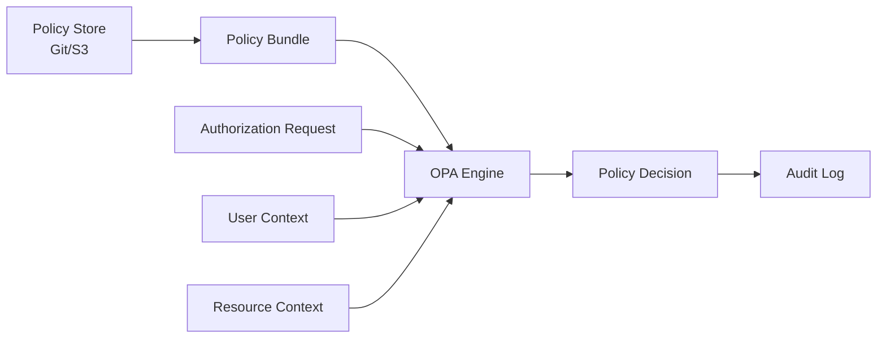

### SCIM 2.0 User and Group Schema

**User Schema Compliance**:
```json
{
  "schemas": ["urn:ietf:params:scim:schemas:core:2.0:User"],
  "id": "user-123",
  "userName": "alice@acme.com",
  "name": {
    "formatted": "Alice Johnson",
    "familyName": "Johnson", 
    "givenName": "Alice"
  },
  "emails": [
    {
      "value": "alice@acme.com",
      "type": "work",
      "primary": true
    }
  ],
  "groups": [
    {
      "value": "group-456",
      "display": "ML Engineering Team",
      "type": "direct"
    }
  ],
  "enterpriseUser": {
    "costCenter": "R&D-ML",
    "organization": "Acme Corp",
    "division": "Engineering"
  },
  "maasUser": {
    "tier": "enterprise",
    "apiQuota": 1000000,
    "preferredModels": ["gpt-4", "claude-3"]
  }
}
```

**Group Schema Compliance**:
```json
{
  "schemas": ["urn:ietf:params:scim:schemas:core:2.0:Group"],
  "id": "group-456",
  "displayName": "ML Engineering Team",
  "members": [
    {
      "value": "user-123",
      "display": "Alice Johnson",
      "type": "User"
    }
  ],
  "maasGroup": {
    "subscriptionId": "sub-789",
    "defaultPolicies": ["rbac-ml-engineer"],
    "costCenter": "R&D-ML"
  }
}
```

### FinOps Foundation Principles

**Cost Optimization Framework**:
1. **Inform**: Real-time cost visibility and allocation
2. **Optimize**: Usage-based recommendations and right-sizing
3. **Operate**: Automated cost controls and governance

**FinOps Capabilities Implementation**:

| Capability | MaaS Implementation | Metrics |
|------------|-------------------|---------|
| **Cost Allocation** | Group-based chargeback with project tagging | Cost per group, user, model |
| **Forecasting** | ML-based usage prediction | 30/90-day cost projections |
| **Budgets & Alerts** | Subscription quota management | Budget variance, threshold alerts |
| **Rightsizing** | Model recommendation engine | Model efficiency scores |
| **Rate Optimization** | Volume discounts and reserved capacity | Effective rates, savings achieved |
| **Waste Reduction** | Idle quota identification | Unused quota percentage |

**Cost Attribution Model**:
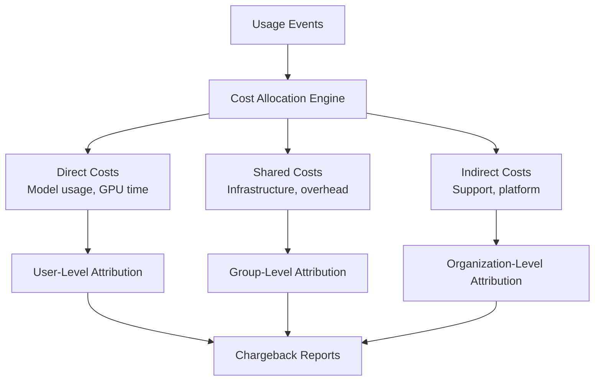

### OpenTelemetry Standards

**Semantic Conventions**:
```yaml
# Model invocation span
span_name: "maas.model.invoke"
attributes:
  # Service attributes
  service.name: "maas-api-gateway"
  service.version: "1.2.3"
  
  # MaaS-specific attributes  
  maas.user.id: "user-123"
  maas.subscription.id: "sub-789"
  maas.model.id: "gpt-4"
  maas.model.provider: "openai"
  maas.policy.decisions: ["rbac:allow", "quota:ok"]
  
  # Request attributes
  http.method: "POST"
  http.route: "/v1/models/{model}/invoke"
  http.status_code: 200
  
  # Usage attributes
  maas.tokens.input: 150
  maas.tokens.output: 300
  maas.cost.usd: 0.045
```

**Custom Metrics**:
```yaml
# Histogram for request duration
maas_request_duration_seconds:
  type: histogram
  description: "Duration of MaaS model requests"
  unit: "s"
  attributes: [user_id, model_id, subscription_tier]

# Counter for token usage
maas_tokens_consumed_total:
  type: counter
  description: "Total tokens consumed"
  unit: "1"
  attributes: [user_id, model_id, token_type]

# Gauge for quota utilization
maas_quota_utilization_ratio:
  type: gauge
  description: "Subscription quota utilization"
  unit: "1"
  attributes: [subscription_id, quota_type]
```

### CloudEvents Schema

**Usage Event Schema**:
```json
{
  "specversion": "1.0",
  "type": "io.maas.usage.v1",
  "source": "maas-api-gateway",
  "id": "event-uuid",
  "time": "2024-10-27T10:30:00Z",
  "datacontenttype": "application/json",
  "subject": "user:user-123",
  "dataschema": "https://schemas.maas.io/usage/v1.json",
  "data": {
    "usage_record_id": "ur-uuid",
    "user_id": "user-123", 
    "subscription_id": "sub-789",
    "model_id": "gpt-4",
    "metrics": {
      "input_tokens": 150,
      "output_tokens": 300,
      "cost_usd": 0.045
    }
  }
}
```

**Policy Event Schema**:
```json
{
  "specversion": "1.0",
  "type": "io.maas.policy.evaluation.v1",
  "source": "maas-policy-engine",
  "subject": "policy:rbac-ml-engineer",
  "data": {
    "policy_id": "rbac-ml-engineer",
    "evaluation_result": "allow",
    "user_id": "user-123",
    "resource": "model:gpt-4",
    "decision_factors": [
      "user.groups contains ml-engineers",
      "model.tier in allowed_tiers"
    ]
  }
}
```

### CNCF Multi-Tenancy Working Group

**Tenancy Models**:
1. **Namespace-as-a-Service**: Each group gets dedicated namespace
2. **Policy-Based Isolation**: Shared infrastructure with policy enforcement
3. **Virtual Cluster**: Dedicated control plane per enterprise customer

**Security Boundaries**:
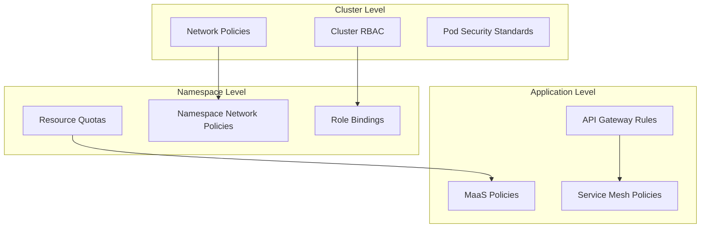

**Resource Isolation**:
- CPU/Memory quotas per subscription tier
- Storage isolation for user data and model artifacts
- Network segmentation for enterprise customers
- Secret isolation for API keys and credentials

---

## 10. Risks and Open Questions

### Architectural Risks

#### Scalability Concerns

**Risk**: Policy evaluation latency at scale
- **Impact**: High latency for policy decisions with large user bases and complex hierarchies
- **Mitigation**: 
  - Policy caching with TTL-based invalidation
  - Pre-computed policy decisions for common scenarios
  - Async policy evaluation for non-critical decisions
  - Horizontal scaling of OPA instances with load balancing

**Risk**: Billing data volume and processing
- **Impact**: Large-scale usage events could overwhelm billing system
- **Mitigation**:
  - Event streaming with Apache Kafka for high throughput
  - Batch processing for non-real-time billing calculations
  - Data partitioning by time and subscription
  - Archival strategies for historical usage data

#### Data Consistency Challenges

**Risk**: Eventual consistency in distributed policy updates
- **Impact**: Brief windows where policy decisions may be inconsistent
- **Mitigation**:
  - Version-controlled policy deployments with rollback capability
  - Circuit breaker patterns for policy service failures
  - Default-deny fallback policies for safety
  - Policy change impact analysis before deployment

**Risk**: Usage tracking accuracy across service boundaries
- **Impact**: Billing discrepancies due to missed or duplicated events
- **Mitigation**:
  - Idempotent usage event processing with deduplication
  - Event sourcing for complete audit trail
  - Reconciliation processes to detect and correct discrepancies
  - Compensation transactions for billing adjustments

#### Security and Compliance Risks

**Risk**: Policy bypass through privilege escalation
- **Impact**: Unauthorized access to models or excessive usage
- **Mitigation**:
  - Principle of least privilege in policy design
  - Regular policy audits and penetration testing
  - Immutable policy deployment pipeline
  - Real-time anomaly detection for unusual usage patterns

**Risk**: Data residency and cross-border compliance
- **Impact**: Regulatory violations in multi-region deployments
- **Mitigation**:
  - Geographic policy enforcement based on user attributes
  - Data sovereignty controls in multi-region architectures
  - Compliance frameworks aligned with GDPR, SOC2, HIPAA
  - Regular compliance audits and certifications

### Design Trade-offs

#### Policy Model Complexity vs. Performance

**Trade-off**: Rich policy language vs. evaluation speed
- **Current Approach**: OPA/Cedar for expressiveness with caching for performance
- **Alternative**: Simple RBAC with hardcoded rules for faster evaluation
- **Decision Factors**: Enterprise requirements for complex policies outweigh performance concerns
- **Monitoring**: Policy evaluation latency percentiles and cache hit rates

#### Billing Granularity vs. System Overhead

**Trade-off**: Real-time billing vs. batch processing efficiency
- **Current Approach**: Near real-time with 1-minute aggregation windows
- **Alternative**: Hourly/daily batch processing for cost efficiency
- **Decision Factors**: Customer demand for real-time cost visibility
- **Monitoring**: Billing processing lag and cost per billing event

#### Multi-tenancy Isolation vs. Resource Efficiency

**Trade-off**: Strong tenant isolation vs. resource utilization
- **Current Approach**: Namespace-based isolation with shared infrastructure
- **Alternative**: Virtual clusters or dedicated nodes per enterprise
- **Decision Factors**: Cost efficiency while meeting enterprise security requirements
- **Monitoring**: Resource utilization and cross-tenant performance impact

### Open Questions

#### Technical Architecture

1. **Policy Conflict Resolution**: How should we handle conflicting policies at the same priority level?
   - Proposal: Explicit conflict detection with admin resolution workflow
   - Alternative: Default-deny for conflicts with audit logging

2. **Cross-Region Policy Synchronization**: How do we maintain policy consistency across geographic regions?
   - Proposal: Master-slave replication with regional policy caches
   - Alternative: Federated policy management with region-specific overrides

3. **Billing Currency and Taxation**: How do we handle multi-currency billing and tax compliance?
   - Proposal: Integration with tax calculation services (Avalara, TaxJar)
   - Alternative: Simplified single-currency with customer responsibility for taxes

#### Business Model Questions

4. **Revenue Sharing Complexity**: How do we handle complex marketplace revenue sharing with multiple parties?
   - Proposal: Configurable revenue split engine with audit trails
   - Alternative: Simplified two-party splits initially

5. **Subscription Transferability**: Can enterprise customers transfer subscriptions between groups or users?
   - Proposal: Admin-controlled transfer workflow with billing period alignment
   - Alternative: Fixed subscription ownership with manual migration process

6. **Usage Attribution**: How do we handle shared API keys or service accounts?
   - Proposal: Context-based attribution using request metadata
   - Alternative: Explicit user impersonation headers required

#### Compliance and Governance

7. **Data Retention Policies**: How long should we retain usage data for billing disputes and audits?
   - Proposal: 7-year retention aligned with financial auditing standards
   - Alternative: Configurable retention per customer compliance requirements

8. **Policy Audit Requirements**: What audit trails are needed for policy changes and access decisions?
   - Proposal: Immutable audit logs with cryptographic integrity verification
   - Alternative: Standard application logs with regular compliance reviews

9. **Model Approval Workflows**: Should enterprise customers require approval for new model access?
   - Proposal: Configurable approval workflows with delegation capabilities
   - Alternative: Pre-approved model catalogs with automatic access grants

### Risk Mitigation Strategies

#### Short-term (0-3 months)
- Implement comprehensive monitoring and alerting for all critical paths
- Establish policy testing framework with automated validation
- Create operational runbooks for common failure scenarios
- Implement circuit breakers and graceful degradation patterns

#### Medium-term (3-12 months)
- Conduct load testing and capacity planning for scale targets
- Implement advanced caching strategies for policy and billing data
- Establish formal change management processes for policy updates
- Develop automated compliance checking and reporting tools

#### Long-term (12+ months)
- Evaluate next-generation policy engines and billing platforms
- Implement advanced machine learning for fraud detection and cost optimization
- Establish formal vendor risk management for critical dependencies
- Develop disaster recovery and business continuity plans

### Success Metrics

**Technical Metrics**:
- Policy evaluation latency: P95 < 50ms
- Billing accuracy: 99.9% event capture rate
- System availability: 99.95% uptime SLA
- Policy cache hit rate: > 90%

**Business Metrics**:
- Customer satisfaction: NPS > 50 for billing transparency
- Revenue attribution accuracy: < 1% billing disputes
- Onboarding time: < 24 hours for new enterprise customers
- Cost optimization: 15% average customer cost reduction through insights

This comprehensive analysis of risks and open questions provides a foundation for making informed architectural decisions and prioritizing risk mitigation efforts as the MaaS platform scales.

---

## Conclusion

This proposal establishes a robust, standards-aligned entity framework that transforms the MaaS platform from a collection of disconnected services into a unified, policy-driven architecture. The seven core entities and their relationships enable transparent cost attribution, scalable multi-tenancy, and enterprise-grade governance while maintaining the flexibility to support diverse use cases from individual developers to AI model marketplaces.

The progressive implementation approach, starting with basic single-user scenarios and scaling to complex enterprise hierarchies, provides a clear roadmap for platform evolution. Standards alignment with OPA/Cedar, SCIM 2.0, FinOps, OpenTelemetry, and CloudEvents ensures interoperability and reduces vendor lock-in risks.

Key success factors for implementation include:
- Comprehensive monitoring and observability from day one
- Rigorous testing of policy evaluation and billing accuracy
- Clear migration paths from the current minimal implementation
- Strong operational practices for policy management and system reliability

This architecture positions the MaaS platform to compete effectively in the enterprise AI market while providing the flexibility to adapt to evolving customer requirements and industry standards.