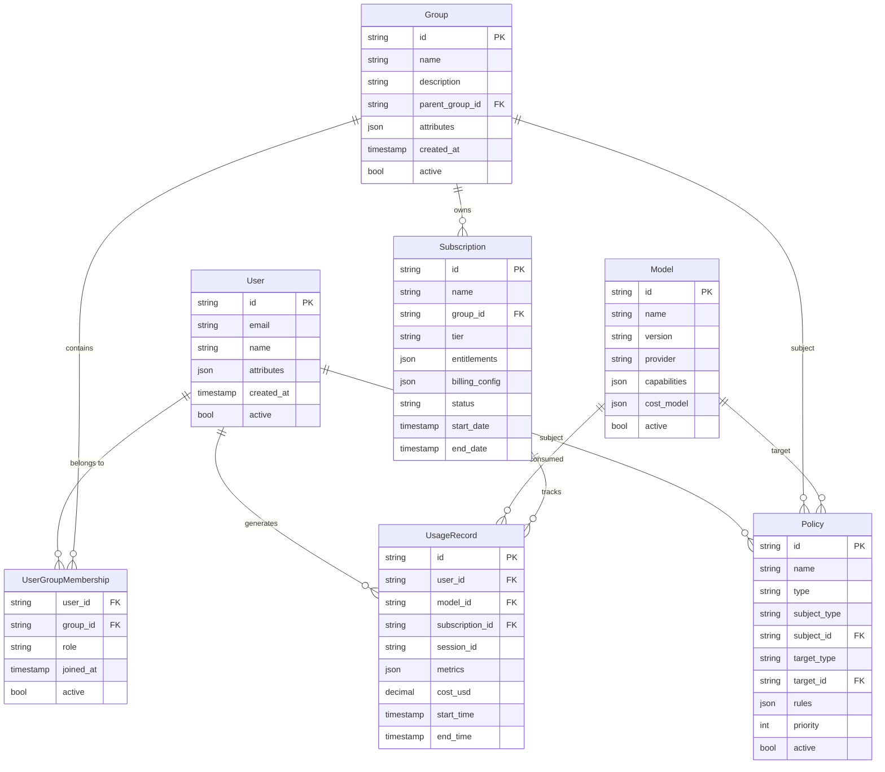
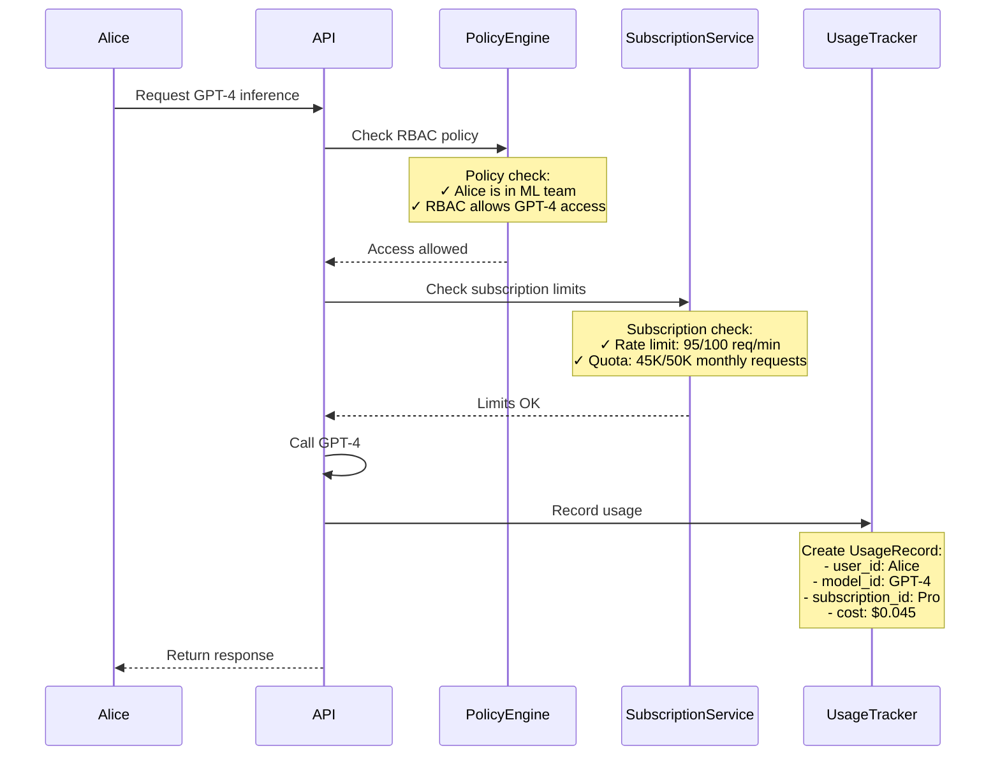

# MaaS Entity Architecture
## Core Entities and Relationships

**Author:** Noy Itzikowitz - with some help from Claude Code :)  
**Status:** Draft  
**Created:** 2024-10-27  
**Updated:** 2024-10-27  

---

## Overview

This document defines the core entities for the MaaS platform and their relationships. The goal is to establish a unified data model that enables:

- **Clear Entity Relationships**: Users belong to Groups, Groups own Subscriptions
- **Separation of Concerns**: 
  - **Subscriptions** define commercial limits (rate limits, quotas, billing)
  - **Policies** define access control (who can access what models)
- **Usage Tracking**: Direct correlation between usage and billing
- **Transparent Attribution**: Cost tracking from user action to billing

## Problem Statement

**Current Issues:**
- Users and groups are not properly structured
- No clear relationship between policies, subscriptions, and usage
- Billing and access control are disconnected
- Cannot track costs by user/group effectively

**Goals:**
- Define 6 core entities with clear relationships
- **Subscription-driven limits**: Rate limits and quotas defined by what you pay for
- **Policy-driven access**: Who can access which models and features
- Connect usage events to billing and policy decisions
- Support multi-tenant enterprise scenarios

---

## Key Design Principle: Subscription vs Policy Separation

**Important**: We separate commercial concerns from access control:

| Concern | Handled By | Examples |
|---------|------------|----------|
| **Commercial Limits** | Subscription | Rate limits, quotas, billing rates, cost caps |
| **Access Control** | Policy | Who can access which models, RBAC rules, permissions |

This separation means:
- **Subscription entitlements** define what you can consume (based on what you pay)
- **Policies** define what you're allowed to access (based on permissions)
- **Both are enforced** together during request evaluation

---

## Core Entities

We define 6 core entities that work together to enable this separation:

### Entity Relationships



## Entity Definitions

### 1. User
Individual users who access models and generate usage.

**Core Fields:**
- `id`: Unique identifier (UUID)
- `email`: Primary email address
- `name`: Display name
- `attributes`: Custom user properties (JSON)
- `active`: Account status

**Example:**
```json
{
  "id": "usr-123e4567-e89b-12d3-a456-426614174000",
  "email": "alice@acme.com",
  "name": "Alice Johnson",
  "attributes": {
    "department": "engineering",
    "role": "ml-engineer",
    "cost_center": "R&D-ML"
  },
  "active": true,
  "created_at": "2024-01-15T10:00:00Z"
}
```

**Relationships:**
- Belongs to multiple Groups (via UserGroupMembership)
- Generates UsageRecords
- Can be subject of Policies

### 2. Group
Organizational units that own subscriptions and enable hierarchical policies.

**Core Fields:**
- `id`: Unique identifier (UUID)
- `name`: Group display name
- `description`: Purpose description
- `parent_group_id`: Parent group for hierarchy (optional)
- `attributes`: Custom group properties (JSON)
- `active`: Group status

**Example:**
```json
{
  "id": "grp-456e7890-e89b-12d3-a456-426614174111",
  "name": "ML Engineering Team",
  "description": "Machine Learning engineers and data scientists",
  "parent_group_id": "grp-789e1234-e89b-12d3-a456-426614174222",
  "attributes": {
    "cost_center": "R&D-ML",
    "budget_limit": 50000,
    "manager": "bob@acme.com"
  },
  "active": true,
  "created_at": "2024-01-10T10:00:00Z"
}
```

**Relationships:**
- Contains multiple Users (via UserGroupMembership)
- Owns Subscriptions
- Can have parent/child Groups
- Can be subject of Policies

### 3. UserGroupMembership
Links users to groups with roles and permissions.

**Core Fields:**
- `user_id`: User identifier (FK)
- `group_id`: Group identifier (FK) 
- `role`: User's role in the group
- `joined_at`: When user joined
- `active`: Membership status

**Example:**
```json
{
  "user_id": "usr-123e4567-e89b-12d3-a456-426614174000",
  "group_id": "grp-456e7890-e89b-12d3-a456-426614174111",
  "role": "ml-engineer",
  "joined_at": "2024-01-15T10:00:00Z",
  "active": true
}
```

### 4. Policy
Defines access control rules (NOT rate limits or quotas).

**Core Fields:**
- `id`: Unique identifier (UUID)
- `name`: Human-readable name
- `type`: Policy type (rbac, abac)
- `subject_type`: Who it applies to (user, group)
- `subject_id`: Specific subject ID
- `target_type`: What it controls (model, resource)
- `target_id`: Specific target ID (optional)
- `rules`: Policy logic (JSON)
- `priority`: Evaluation order (higher = priority)
- `active`: Policy status

**Example - RBAC Policy:**
```json
{
  "id": "pol-789e1234-e89b-12d3-a456-426614174333",
  "name": "ML Team GPT-4 Access",
  "type": "rbac",
  "subject_type": "group",
  "subject_id": "grp-456e7890-e89b-12d3-a456-426614174111",
  "target_type": "model",
  "target_id": "gpt-4",
  "rules": {
    "allow": [
      {
        "action": "invoke",
        "conditions": ["user.role in ['ml-engineer', 'senior-engineer']"]
      }
    ]
  },
  "priority": 100,
  "active": true
}
```

**Note**: Rate limits and quotas are NOT defined in policies - they come from the subscription's entitlements.

**Relationships:**
- Applies to Users or Groups (subject)
- Controls access to Models (target)

### 5. Subscription
Defines entitlements and billing for a group.

**Core Fields:**
- `id`: Unique identifier (UUID)
- `name`: Subscription name
- `group_id`: Owning group (FK)
- `tier`: Service level (free, pro, enterprise)
- `entitlements`: Usage limits and access (JSON)
- `billing_config`: Billing settings (JSON)
- `status`: Current status (active, suspended, expired)
- `start_date`: Subscription start
- `end_date`: Subscription end (optional)

**Example:**
```json
{
  "id": "sub-abc1234-e89b-12d3-a456-426614174444",
  "name": "ML Team Pro Subscription",
  "group_id": "grp-456e7890-e89b-12d3-a456-426614174111",
  "tier": "pro",
  "entitlements": {
    "rate_limits": {
      "requests_per_minute": 100,
      "tokens_per_hour": 50000
    },
    "quotas": {
      "monthly_requests": 100000,
      "monthly_tokens": 5000000,
      "monthly_cost_usd": 2000
    },
    "model_access": ["gpt-4", "claude-3", "llama-70b"]
  },
  "billing_config": {
    "rate_per_token": 0.0001,
    "minimum_monthly": 100,
    "currency": "USD"
  },
  "status": "active",
  "start_date": "2024-01-01T00:00:00Z",
  "end_date": "2024-12-31T23:59:59Z"
}
```

**Relationships:**
- Owned by one Group
- Tracks UsageRecords

### 6. Model
Represents AI models available for use.

**Core Fields:**
- `id`: Unique identifier
- `name`: Model name
- `version`: Model version
- `provider`: Provider (openai, anthropic, etc.)
- `capabilities`: Model specifications (JSON)
- `cost_model`: Pricing information (JSON)
- `active`: Availability status

**Example:**
```json
{
  "id": "gpt-4",
  "name": "GPT-4",
  "version": "gpt-4-0613",
  "provider": "openai",
  "capabilities": {
    "max_tokens": 8192,
    "supports_functions": true,
    "modalities": ["text"]
  },
  "cost_model": {
    "input_token_rate_usd": 0.00003,
    "output_token_rate_usd": 0.00006,
    "currency": "USD",
    "billing_unit": "token"
  },
  "active": true
}
```

**Relationships:**
- Used in UsageRecords
- Controlled by Policies

### 7. UsageRecord
Captures individual usage events for billing and tracking.

**Core Fields:**
- `id`: Unique identifier (UUID)
- `user_id`: User who made the request (FK)
- `model_id`: Model that was used (FK)
- `subscription_id`: Associated subscription (FK)
- `session_id`: Request session identifier
- `metrics`: Usage details (JSON)
- `cost_usd`: Calculated cost in USD
- `start_time`: Request start time
- `end_time`: Request completion time

**Example:**
```json
{
  "id": "usage-def5678-e89b-12d3-a456-426614174555",
  "user_id": "usr-123e4567-e89b-12d3-a456-426614174000",
  "model_id": "gpt-4",
  "subscription_id": "sub-abc1234-e89b-12d3-a456-426614174444",
  "session_id": "sess-xyz9876",
  "metrics": {
    "input_tokens": 150,
    "output_tokens": 300,
    "processing_time_ms": 2500,
    "response_status": "success"
  },
  "cost_usd": 0.045,
  "start_time": "2024-01-15T14:30:00Z",
  "end_time": "2024-01-15T14:30:02.5Z"
}
```

**Relationships:**
- Generated by Users
- Consumes Models  
- Tracked by Subscriptions

---

## Example Scenario

Let's see how these entities work together in a practical example:

### Scenario: ML Team Uses GPT-4

**Setup:**
1. **User**: Alice (ML Engineer)
2. **Group**: "ML Engineering Team"  
3. **Subscription**: Pro tier owned by the group
4. **Policy**: RBAC policy allowing ML engineers to use GPT-4
5. **Model**: GPT-4 model
6. **UsageRecord**: Generated when Alice uses GPT-4

**Flow:**


**Data Created:**
- **UsageRecord** links Alice → GPT-4 → Pro Subscription
- **Cost** is attributed to the ML team's subscription
- **Both policy and subscription checks** are logged for audit

This demonstrates the **separation of concerns**:
- **Policy** controls WHO can access WHAT (Alice can use GPT-4)
- **Subscription** controls HOW MUCH can be consumed (100 req/min, 50K/month)
- **Both must pass** for the request to succeed

---

## Next Steps

This document focuses on core entities and relationships. Additional documents should cover:

1. **Policy Implementation Guide** - Detailed policy rules and inheritance
2. **Billing and Subscription Management** - Pricing models and billing flows  
3. **API Design** - REST endpoints for entity management
4. **Database Schema** - Implementation details and constraints
5. **Migration Guide** - Moving from current to new entity model

The goal is to implement these entities incrementally, starting with the basic User → Group → Subscription relationships.